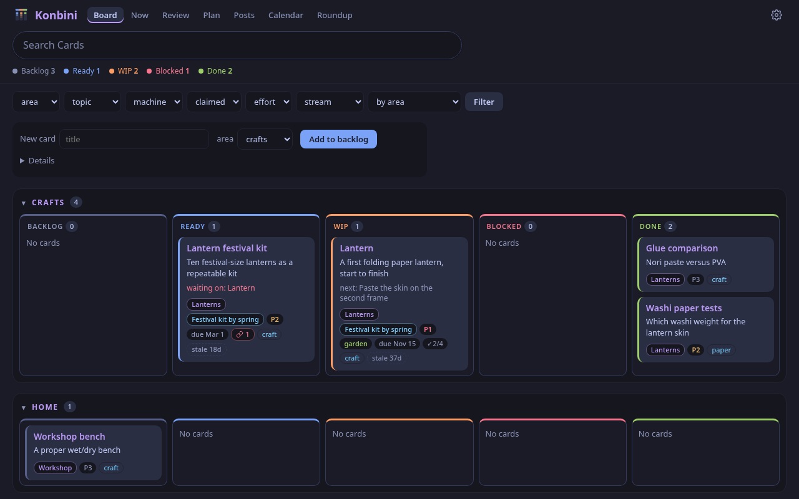
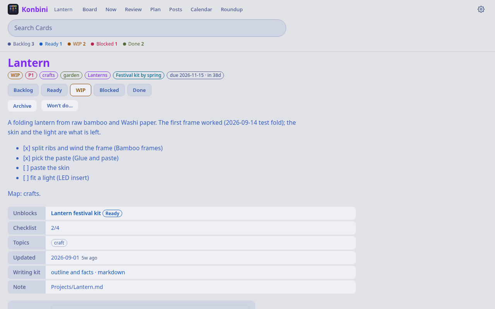
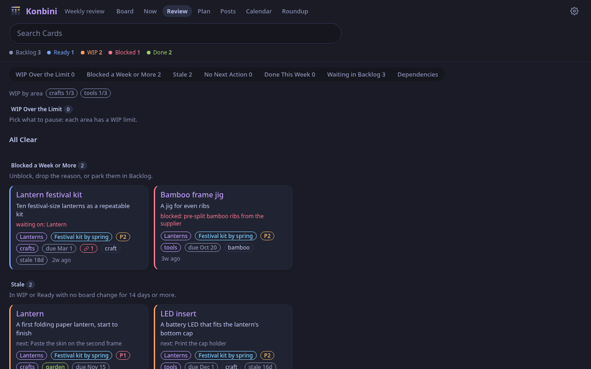
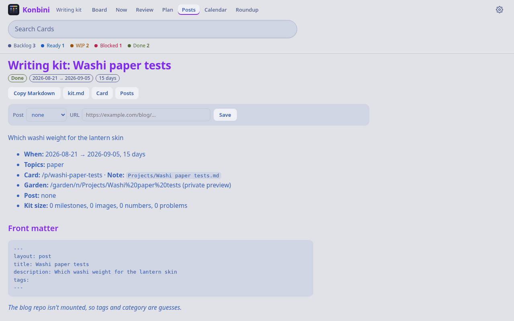
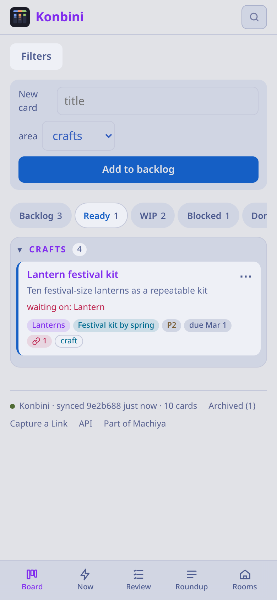

# Konbini

[Machiya](https://github.com/machiya-kobo/machiya) is a set of small self-hosted apps for finding what you've read: your pages ([Hister](https://github.com/asciimoo/hister)), the web ([SearXNG](https://github.com/searxng/searxng)), your notes ([Obsidian](https://obsidian.md)) and your code ([Forgejo](https://forgejo.org) or [GitHub](https://github.com)).

Konbini (コンビニ, "convenience store") is the project board for Machiya and turns your Obsidian notes into a fully featured kanban board. It's also a writing kit that lays out a finished project for its blog post.

<p align="center">
<a href="https://machiya-kobo.github.io/machiya/">Machiya</a> · <a href="#quickstart">Quickstart</a> · <a href="#more-ways-to-run-it">More ways to run it</a> · <a href="docs/access.md">Access</a> · <a href="docs/settings.md">Settings</a> · <a href="docs/vault-layout.md">Vault layout</a> · <a href="docs/pm.md">pm</a> · <a href="#license">License</a>
</p>

<p align="center"><a href="docs/screenshots/konbini-board-dark.png"></a><br>Manage your projects</p>
<table>
  <tr>
    <td align="center" width="33%"><a href="docs/screenshots/konbini-card-light.png"></a><br>Open a card</td>
    <td align="center" width="33%"><a href="docs/screenshots/konbini-review-dark.png"></a><br>Review your week</td>
    <td align="center" width="33%"><a href="docs/screenshots/konbini-kit-light.png"></a><br>Write up a finished project</td>
  </tr>
</table>
<p align="center"><a href="docs/screenshots/konbini-board-phone-light.png"></a><br>Take the board with you</p>

Every screenshot uses the sample vault: a paper-lantern workshop and a trip to Kyoto.

- **Your notes are the board.** A note whose `status:` is a column (backlog, ready, wip, blocked, done, archived) is
  a card.
- **Git keeps the history.** Konbini commits its edits to your vault. Its database is only a cache.
- **Installs on your phone** from the browser's menu, like an app.
- **Offline support.** Changes wait on your device and go out when you're back on The Internet. If someone changed the
  card meanwhile, you pick which version stays.
- **Capture a link** from the Android or Chrome share sheet, or an iOS Shortcut that opens `/share?url=…&title=…`.
- **Scripts and AI agents welcome**, over a small HTTP API or `pm`, the command line.

Konbini runs on its own; the other [Machiya](https://github.com/machiya-kobo/machiya) apps are optional. With them, a
card links to its note in Kura (the note reader) and Niwa (the garden), and Shiori, the search app, reads your cards.
Niwa takes its column badges and the board half of its stream from `/api/cards` and `/api/digest`.

## Quickstart

Konbini on your own machine with the sample vault, a paper-lantern workshop and a trip to Kyoto. It listens on
`127.0.0.1` only, so there's nothing to sign in to. You need Python 3.11 or newer, `git` and `curl`. These are the
Debian and Ubuntu commands; containers and the BSDs are under [More ways to run it](#more-ways-to-run-it).

<!-- quickstart: packages-debian -->
```bash
sudo apt update
sudo apt install -y python3 python3-venv git curl
```

**1. Get the code**

```sh
git clone https://github.com/machiya-kobo/konbini.git && cd konbini
```

**2. Install its two Python packages,** `markdown` and `pyyaml`, in a virtual environment:

<!-- quickstart: native-install-debian -->
```bash
python3 -m venv .venv
.venv/bin/pip install markdown pyyaml
```

**3. Make the sample vault a git repository.** Konbini commits its edits, so the copy has to be one.

<!-- quickstart: vault -->
```bash
tools/demo-vault demo-vault
mkdir -p demo-data
```

**4. Start it.** `KANBAN_AUTH=open` turns the login off, so keep it to your own machine.

<!-- quickstart: native-run-debian background -->
```bash
KANBAN_REPO="$PWD/demo-vault" KANBAN_DB="$PWD/demo-data/konbini.sqlite3" \
  KANBAN_AUTH=open KANBAN_BIND=127.0.0.1 KANBAN_REPO_SUBDIR=personal .venv/bin/python app/app.py
```

| App | Address |
|---|---|
| Konbini | http://127.0.0.1:8081/ |

You should see ten cards across the columns. Ctrl-C stops it; `rm -rf demo-vault demo-data .venv` cleans up.

### Next

- **Script it:** [`pm`, the command line](docs/pm.md), and [a quick check](docs/install.md#check-it-and-drive-it-with-pm).
- **Use your own vault:** point `KANBAN_REPO` at a clone of it ([what Konbini reads and writes](docs/vault-layout.md)).
- **Let more people in:** Tailscale, sign-in or Hister accounts ([access](docs/access.md)).
- **Run it in a container or on the BSDs:** [install guide](docs/install.md).
- **Run the whole stack:** [Machiya's Quickstart](https://github.com/machiya-kobo/machiya#quickstart).

## More ways to run it

Podman and Docker, OpenBSD, FreeBSD and NetBSD, and the Machiya stack: [docs/install.md](docs/install.md).

## Docs

- [Who can use it](docs/access.md): localhost, Tailscale, Machiya's identity file and Hister accounts; sign-in, pairing
  and preferences.
- [Settings](docs/settings.md): every `KANBAN_*` and `MACHIYA_*` setting.
- [Vault layout](docs/vault-layout.md): the notes Konbini reads and the edits it writes.
- [The pm command line](docs/pm.md).
- [Changelog](app/CHANGELOG.md) · [Contributing](CONTRIBUTING.md) · [Security](SECURITY.md)

## License

Copyright (C) 2026 Micheal Waltz and Machiya contributors.

Konbini is free software: GNU Affero General Public License, version 3 or (at your option) any later version. See
`LICENSE`. What it ships from other projects (SortableJS, Mermaid, the Hister CLI in the image) is listed in
`THIRD_PARTY_NOTICES`. `app/urlnorm.py`, the URL normalization rule shared with Niwa, is Konbini's own code under the
same license.
