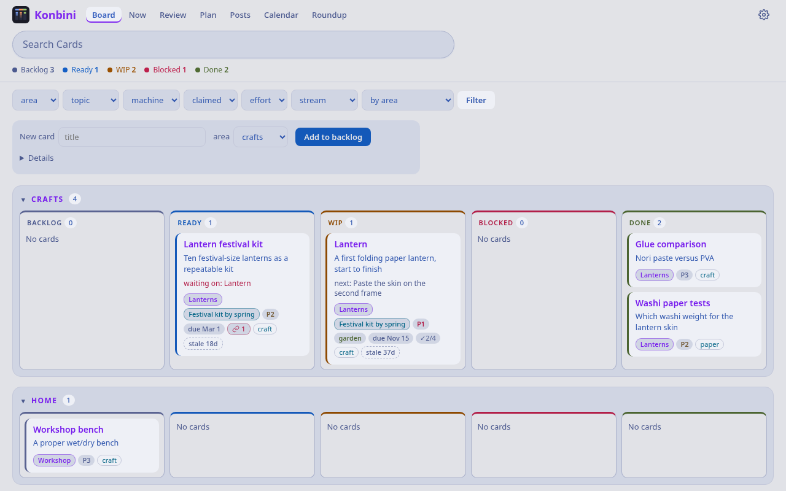
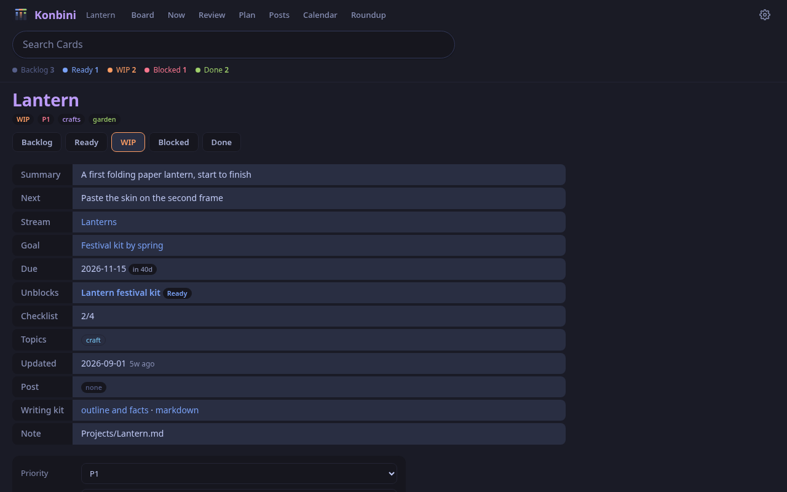
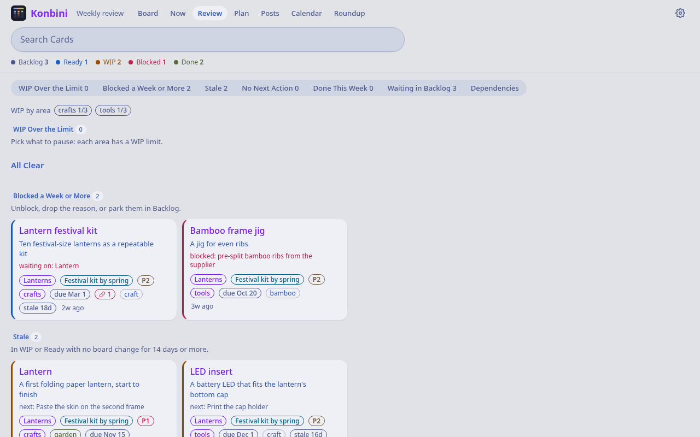
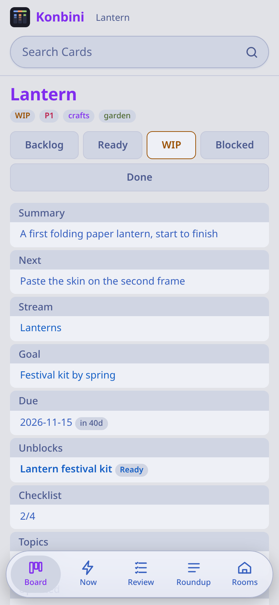

# konbini

A kanban board (Konbini) built from an Obsidian vault's frontmatter, driven by people and scripts (including AI
agents) over a small HTTP API, installable on a phone. It is part of
[Machiya](https://github.com/machiya-kobo/machiya), a small stack of services around a vault of notes; the garden (Niwa) and
the note reader (Kura) are its sister services, and Shiori is its search app. All of them are optional: Konbini runs
alone.

- The notes are the source of truth; SQLite is a cache; git is the backup.
- Cards are notes whose `status:` is a board column (backlog, ready, wip, blocked, done, archived).
- Every card gets a writing kit: the facts of a finished project, laid out for a blog post.
- `/api/cards` and `/api/digest` feed Niwa's column badges and the board half of its stream.

## Quickstart

Two ways to run Konbini: **A. on its own**, with a small sample vault (about five minutes, nothing else needed), or
**B. as one of the Machiya services** next to Kura, Niwa and the search engines. Every block below marked `quickstart:` is
run by `tools/quickstart-test`, so these are exactly the commands that were tested.

**You need:** `git`; one of `podman` (4 or newer) or `docker` (24 or newer) for the container path, or Python 3.11 or
newer for the native path (the image uses 3.13; `markdown` 3.4+ and `pyyaml` 6+ are the only dependencies);
`curl` for the checks. Port 8081 on this machine must be free.

### A. Standalone, with the sample vault

**1. Install what you need** (skip what you already have; this is the only step that needs root). Pick your system:

*Debian or Ubuntu, container path (podman):*

<!-- quickstart: packages-container-debian -->
```bash
sudo apt update
sudo apt install -y podman git curl
```

*Debian or Ubuntu, native path:*

<!-- quickstart: packages-debian -->
```bash
sudo apt update
sudo apt install -y python3 python3-venv git curl
```

*OpenBSD:*

<!-- quickstart: packages-openbsd -->
```bash
doas pkg_add python%3 py3-markdown py3-yaml git curl
```

*FreeBSD* (the packages install a versioned interpreter, so the second line gives it the name `python3` used below):

<!-- quickstart: packages-freebsd -->
```bash
sudo pkg install -y python312 py312-sqlite3 py312-markdown py312-pyyaml git-lite curl
sudo ln -sf /usr/local/bin/python3.12 /usr/local/bin/python3
```

*NetBSD* (same; a fresh NetBSD has no `pkgin`, so this uses `pkg_add` with the release's package repository):

<!-- quickstart: packages-netbsd -->
```bash
sudo env PKG_PATH="https://cdn.NetBSD.org/pub/pkgsrc/packages/NetBSD/$(uname -p)/$(uname -r | cut -d_ -f1)/All" \
  pkg_add python313 py313-markdown py313-yaml git-base curl
sudo ln -sf /usr/pkg/bin/python3.13 /usr/pkg/bin/python3
```

For the container path with docker, install docker with your system's own instructions.

**2. Get the code and make the sample vault a git repository.** Konbini reads a git repository of Markdown notes and
commits its edits to it, so the demo copy has to be one. Run these from the root of this repository
(`git clone https://github.com/machiya-kobo/konbini && cd konbini`):

<!-- quickstart: vault -->
```bash
tools/demo-vault demo-vault
mkdir -p demo-data
```

The sample vault is a small invented one (a paper-lantern workshop and a trip to Kyoto: ten cards in every column, three
streams, two goals); `tools/demo-vault` copies it into `demo-vault` and commits it. Its notes are in a `personal/`
folder, which is why the commands below set `KANBAN_REPO_SUBDIR=personal` (by default Konbini reads the repository
root).

**3. Start it**, in a container or natively.

*Container with podman* (`--cgroup-manager=cgroupfs` keeps podman from needing a systemd user session, which a freshly set-up or ssh-only machine may not have yet):

<!-- quickstart: container-podman -->
```bash
podman --cgroup-manager=cgroupfs build -t konbini app
podman --cgroup-manager=cgroupfs run -d --init --name konbini-demo -p 127.0.0.1:8081:8081 --userns=keep-id \
  -v "$PWD/demo-vault":/repo -v "$PWD/demo-data":/data -e KANBAN_AUTH=open -e KANBAN_REPO_SUBDIR=personal konbini
```

*Container with docker* (it runs as your own user, so the mounted folders stay yours):

<!-- quickstart: container-docker -->
```bash
docker build -t konbini app
docker run -d --init --name konbini-demo -p 127.0.0.1:8081:8081 -u "$(id -u):$(id -g)" \
  -v "$PWD/demo-vault":/repo -v "$PWD/demo-data":/data -e KANBAN_AUTH=open -e KANBAN_REPO_SUBDIR=personal konbini
```

*Natively on Debian or Ubuntu:*

<!-- quickstart: native-install-debian -->
```bash
python3 -m venv .venv
.venv/bin/pip install markdown pyyaml
```

<!-- quickstart: native-run-debian background -->
```bash
KANBAN_REPO="$PWD/demo-vault" KANBAN_DB="$PWD/demo-data/konbini.sqlite3" \
  KANBAN_AUTH=open KANBAN_BIND=127.0.0.1 KANBAN_REPO_SUBDIR=personal .venv/bin/python app/app.py
```

*Natively on OpenBSD, FreeBSD or NetBSD* (packages only, no pip):

<!-- quickstart: native-run-bsd background -->
```bash
KANBAN_REPO="$PWD/demo-vault" KANBAN_DB="$PWD/demo-data/konbini.sqlite3" \
  KANBAN_AUTH=open KANBAN_BIND=127.0.0.1 KANBAN_REPO_SUBDIR=personal python3 app/app.py
```

`KANBAN_AUTH=open` has no identity check: it is for localhost and a trusted network only. It answers only requests
made to an IP address, `localhost`, `KANBAN_BOARD_URL`'s host or a name in `KANBAN_ALLOWED_HOSTS`.

**4. Check that it is up.** The loop waits up to 30 seconds for the first start (the board indexes the vault):

<!-- quickstart: check -->
```bash
for i in $(seq 30); do curl -sf http://127.0.0.1:8081/healthz >/dev/null && break; sleep 1; done
curl -s http://127.0.0.1:8081/healthz
curl -s http://127.0.0.1:8081/api/status | python3 -c 'import json,sys; d=json.load(sys.stdin); print("ok", d["ok"], "cards", d["cards"])'
curl -s http://127.0.0.1:8081/ | grep -o "<title>[^<]*"
```

You should see:

<!-- quickstart-expect: check -->
```text
ok
ok True cards 10
<title>konbini
```

Open http://127.0.0.1:8081/ in a browser: the board shows ten cards across its columns, and the header leads to
Review, Plan, Calendar and Search.

**5. Drive it from the command line with `pm`.** `tools/pm` is a one-file client (Python 3, no dependencies):

<!-- quickstart: pm -->
```bash
export KANBAN_URL=http://127.0.0.1:8081
python3 tools/pm ls --board wip
python3 tools/pm next led-insert "print the cap holder and test the fit"
git -C demo-vault diff --stat
```

You should see the two cards in progress, then the edit the board made to one note's frontmatter (it commits such edits
to your repository a couple of minutes after the last change):

<!-- quickstart-expect: pm -->
```text
lantern
led-insert
Projects/LED insert.md
1 file changed
```

**6. Stop it and clean up.**

<!-- quickstart: stop-container -->
```bash
podman rm -f konbini-demo 2>/dev/null || docker rm -f konbini-demo
```

For a native run, press Ctrl-C in its terminal. Then remove the demo files: `rm -rf demo-vault demo-data .venv`.

### B. As part of the Machiya stack

[Machiya](https://github.com/machiya-kobo/machiya) runs Konbini, Kura (the note reader) and Niwa (the garden) around one
vault, with Hister and SearXNG as optional search engines. What changes compared with the quickstart above:

- **Start from the reference compose** in the Machiya repository (`compose/compose.yml`, profile `konbini`, plus
  `compose/mirror.yml` for a shared vault copy) instead of the commands above. With the sample vault, run its
  `compose/demo-init` (it writes a `.env` and makes Konbini's clone of a bare copy of the vault); with your own vault,
  copy `compose/.env.example` to `.env`, edit it, and clone your vault into `KONBINI_REPO` first (Konbini needs its own
  read-write clone, and its origin must be reachable so the board can push). The compose builds the image from this
  repository's `app/`.
- **Who may use it.** Behind a proxy that sets `Tailscale-User-Login` (a Tailscale sidecar, for example) leave
  `KANBAN_AUTH` at its default `tailscale` and list the logins in `KANBAN_TAILNET_USERS` (`KONBINI_AUTH=tailscale` and
  `KONBINI_USERS` in the compose), and bind `KANBAN_BIND=127.0.0.1`. The reference compose defaults to
  `KANBAN_AUTH=open` for the localhost demo; there, list the name the other rooms call Konbini by (`konbini`) in
  `KANBAN_ALLOWED_HOSTS`.
- **Notes folder.** If the vault keeps its notes in a folder, set `KANBAN_REPO_SUBDIR` (`VAULT_SUBDIR` in the compose);
  the default is the repository root.
- **One vault copy.** `compose/mirror.yml` (or `demo-init --mirror`) keeps a single shared copy of the vault: it sets
  `KANBAN_REPO_REFERENCE` to the mirror's checkout (mounted at the same path in the container) so Konbini borrows its
  git objects, and `KANBAN_REPO_SPARSE` to `<notes folder>,.board` so it checks out only what it reads and writes (see
  "Stack mode" in `CLAUDE.md`).
- **The other rooms.** Set `KANBAN_KURA_URL` and `KANBAN_NIWA_URL` to their addresses to get "View in Kura" and the
  garden links, `KANBAN_BOARD_URL` to this board's own address, and `MACHIYA_ROOMS` (the same value in every room) for
  the Rooms switcher; the compose passes all of them from its `.env`. `MACHIYA_COOKIE_DOMAIN` (for example `example.net`) shares the theme and text-size cookies across
  the rooms.
- **Source link.** Set `MACHIYA_SOURCE_URL` to where this room's source is published to add a "Source code" link to the
  footer and the About page (the AGPL asks for it when people use a service over a network).
- **Settings from a file.** `KANBAN_ENV_FILE` (or `--env-file PATH`) reads `KEY=VALUE` lines first, for a native
  service (the rc.d scripts and the BSD install guide are in the Machiya repository).

## Screenshots

All taken from the sample vault (`tools/screenshots` makes them again).

| | Light | Dark |
|---|---|---|
| The board |  |  |
| A card |  |  |
| The weekly review |  |  |

On a phone, the board and a card:

 

## Settings

| Setting | Default | |
|---|---|---|
| `KANBAN_ENV_FILE` (or `--env-file PATH`) | — | native installs (e.g. BSD rc.d): read these settings from a file of `KEY=VALUE` lines first; the real environment wins. A missing or bad file stops start-up, naming the file and line |
| `KANBAN_AUTH` | `tailscale` | `tailscale`: every page and write needs a `Tailscale-User-Login` in `KANBAN_TAILNET_USERS`. `open`: no identity check (a startup warning), for localhost or a trusted LAN only; the identity header is ignored and writes are logged as `local`. Either way, form posts must be same-origin, and an API write from outside the board's pages must send `X-Agent` and no cross-site `Origin` or `Referer` (CSRF; 403 otherwise). Any other value refuses to start |
| `KANBAN_ALLOWED_HOSTS` | — | with `KANBAN_AUTH=open`: the host names the board answers to, comma-separated (case, port and a trailing dot don't matter), on top of IP addresses, `localhost` and `KANBAN_BOARD_URL`'s host. Any other `Host` gets 403, so a web page can't reach the board by pointing its own name at your machine (DNS rebinding). Ignored with `tailscale` |
| `KANBAN_TAILNET_USERS` | — | allowed `Tailscale-User-Login`s, comma-separated; unset = nobody (with `KANBAN_AUTH=tailscale`) |
| `KANBAN_BIND` | `0.0.0.0` | the address the listener binds. Behind `tailscale serve` on a native install, bind `127.0.0.1`: on a public bind anyone who reaches the port could send the `Tailscale-User-Login` header |
| `KANBAN_TAILNET_PORT` | `8081` | the listener's port |
| `KANBAN_REPO`, `KANBAN_DB` | `/repo`, `/data/kanban.sqlite3` | the board's clone of the vault and its SQLite cache |
| `KANBAN_REPO_SUBDIR` | repo root | the folder of the repo that holds the notes, when it is not the root (the board reads and writes only there, plus `.board/`); with `KANBAN_REPO_SPARSE`, name the same folder |
| `KANBAN_EXPORT_IDLE`, `KANBAN_EXPORT_MAX` | `120`, `900` | the board's edits are committed after this many seconds idle, or at most this long after the first one |
| `KANBAN_PULL_SECONDS`, `KANBAN_VERIFY_SECONDS` | `60`, `3600` | how often it pulls the repository, and how often it checks its cache against a fresh scan of the notes |
| `KANBAN_WIP_LIMITS` | — | the weekly review's per-area WIP limits, `ops=4,docs=5` (other areas get 3) |
| `KANBAN_SKIP_COMMITS`, `KANBAN_CALENDAR_SKIP_COMMITS` | — | commit subjects to leave out, comma-separated prefixes (case-insensitive), on top of the board's own `board: ` and `Merge ` commits: the first from the calendar, roundups and kits (e.g. `nightly backup`), the second from the calendar and roundups only (commits the events and Log tables already cover) |
| `KANBAN_ARCHIVE` | `none` | `none`: the link checker still visits the links in cards' notes to see if they are alive, but never contacts the Wayback Machine (snapshots already recorded still show). `wayback` (exactly this word; anything else counts as `none` and logs a warning): it also asks the Wayback Machine for a snapshot of each link and saves one (this sends the URL to archive.org) |
| `KANBAN_REPO_REFERENCE`, `KANBAN_REPO_SPARSE` | — | Machiya stack mode: borrow the stack's vault mirror's objects, and check out only `notes,.board` (your `KANBAN_REPO_SUBDIR` plus `.board`; see `CLAUDE.md`) |
| `KANBAN_BOARD_URL` | — | this board's own address, for absolute links in writing kits |
| `KANBAN_NIWA_URL`, `KANBAN_KURA_URL` | — | the sister rooms (Niwa: the garden links and the `/garden/` redirect; Kura: "View in Kura"). Unset = those links are off |
| `KANBAN_OBSIDIAN_VAULT` | — | the Obsidian vault's name for "Edit in Obsidian" links (`obsidian://open?vault=my-vault`). Unset = no such links |
| `KANBAN_GIT_AUTHOR_NAME`, `KANBAN_GIT_AUTHOR_EMAIL` | `konbini`, `konbini@localhost` | who the board's commits to the vault are by |
| `KANBAN_LINKS_USER_AGENT` | `konbini-links/1` | the link checker's User-Agent (add a contact URL for the sites it checks) |
| `KANBAN_LINKS_SKIP_HOSTS` | — | more hosts the link checker never visits, comma-separated (loopback, `192.168.*`, `10.*`, `100.*`, `*.ts.net` and `archive.org` are always skipped) |
| `KANBAN_HISTER_URL`, `KANBAN_HISTER_PUBLIC`, `KANBAN_COLD_MAP` | — | optional: Hister (private copies of links, "pages I've read") and a cold-archive URL map |
| `KANBAN_HISTER_SAVE` | off | `1`, `on` or `true`: the link checker also indexes live links Hister doesn't have yet (needs `KANBAN_HISTER_URL`). Off: it only shows Hister's existing copy (a read-only lookup); saving pages is Shiori's job |
| `KANBAN_BLOG`, `KANBAN_BLOG_URL`, `KANBAN_BLOG_PERMALINK` | `/blog`, —, `/{year}/{slug}/` | optional: a Jekyll blog checkout (posts in `_posts/` as `YYYY-MM-DD-slug.md` or `.html`, optional `tag/<tag>.md` pages), its address, and the path of a post's page under that address (`{year}` and `{slug}`), for the writing kits' "already written?" links |
| `KANBAN_LIVESYNC_STATUS` | — | optional: a JSON file written by whatever syncs phone edits into the repository (an Obsidian LiveSync bridge), re-read every 10 s and shown in the board's alerts. Keys the board reads: `daemon` (`"running"` or an alert), `last_cycle_ts` (unix seconds, alert if older than 5 minutes) and `last_cycle` (its text), `git_ok_ts` (unix seconds of the last good push, alert after 30 minutes) and `git_ok_at` (its text), `held_deletes` and `unresolved` (lists, alerted by length). Unset or missing = no alerts |
| `KANBAN_REPOS` | `/repos` | optional: read-only checkouts of project repos, for the writing kits' commit lists |
| `TZ` | `UTC` | the board's days (calendar, roundups, the review's week) |
| `MACHIYA_ROOMS` | — | the Rooms switcher, `shiori=https://…,konbini=…,niwa=…,kura=…,hister=…,searxng=…` (the stack sets it) |
| `MACHIYA_SOURCE_URL` | — | where this room's source code is published; when set, the footer and About link to it (AGPL section 13: people who use a service over a network are offered its source). A plain http(s) address |
| `MACHIYA_COOKIE_DOMAIN` | — | share the theme and text-size cookies across rooms on one domain, e.g. `example.net` |

Every setting is in this table: the `KANBAN_*` ones, `TZ` and the `MACHIYA_*` ones.

## Vault layout

Konbini expects a git repository of Markdown notes (the repository root, or one folder of it: set `KANBAN_REPO_SUBDIR`). A card is a note whose `status:` is a board column. New cards are written to `Projects/<Title>.md` with the tags `type/idea` and `area/projects` plus one `area/<lane>` tag: the lane is the first area tag other than `area/projects`. The calendar, roundups and writing kits also read, from any note, dated rows of a table (`| 2026-01-15 | milestone | Shipped | details |`: a date, a category, a change, then anything); a card's `## Log` table gives its milestones, and tables in `Systems/<host>.md` notes give machine changes (without those notes the pages just have fewer rows). A card's note may contain a generated block between `<!-- project-sync:start -->` and `<!-- project-sync:end -->` whose bullets `- YYYY-MM-DD: commit subject` the kit uses as the repository's recent commits when it cannot fetch them. Writing kits can map a card's topics and area onto your blog's tags and categories through an optional `.board/kit.json` in the repository (`tag_synonyms`, `area_category`, `default_category`, `ignore_tags`, `ignore_categories`); without it the blog's own tags and categories drive the kit. Frontmatter fields are described in `docs/frontmatter.md` of the [Machiya repository](https://github.com/machiya-kobo/machiya).

## The pm command line

`tools/pm` is a one-file command line for a board (Python 3, standard library only; copy it onto your `PATH` or run it in place). It talks to Konbini's HTTP API at `KANBAN_URL` (default `http://127.0.0.1:8081`) and sends `X-Agent` (`pm@<host>`, or `KANBAN_AGENT`) so a card's history says who changed it.

```sh
pm ls --area tools            # cards (also --board, --machine, --topic, --tag, --json)
pm show <slug>                # one card
pm new "Title" --area tools --summary "one line"
pm move <slug> wip            # backlog | ready | wip | blocked | done | archived
pm next <slug> "the next concrete action"
pm block <slug> "waiting on a part"      # moves to blocked with a reason
pm log <slug> "a note for the card's history"
pm tag <slug> +topic/a -topic/b          # existing tags only
pm dep <slug> +other-card -old-card      # dependsOn; with no changes it lists them
pm stream <slug> "Release 1.0"           # also: pm goal, pm due; "-" clears
pm claim <slug>                          # "an agent is working on this" badge, 15 minutes
pm review                                # the weekly review (--json for the raw data)
pm roundup week                          # what got done: day | week | month | year
pm kit <slug>                            # the writing kit as Markdown
pm post <slug> drafting <url>            # track the blog post (none, idea, outlined, drafting, published, skipped)
pm health                                # the board's /api/health
```

The area in `pm new` must already exist: the board refuses new `area/*` tags from the command line, so create a first lane in the web form. `pm tag` takes existing tags only. `pm suggest <note>` asks Niwa to consider a note for the garden; it needs `NIWA_URL` (Niwa's address) and is off without it. If the board answers 405 (an endpoint an older board lacks), `pm` says so. The `X-Agent` label (and with it your host name) is recorded in the card's history in the repository's `.board/events`. The settings that start with `KANBAN_` keep the prefix from Konbini's earlier name.

Layout and rules for working on the code: see `CLAUDE.md`; changes by release: `CHANGELOG.md`.

## Licence

Konbini is free software: GNU Affero General Public License, version 3 or (at your option) any later version.
See `LICENSE`. Third-party software it ships (SortableJS, Mermaid, the Hister CLI in the image) is listed with
its licences in `THIRD_PARTY_NOTICES`.
`app/urlnorm.py` (the URL normalisation rule, identical to the copy in Niwa) is the project's own code, under the same licence.

Copyright (C) 2026 Micheal Waltz and Machiya contributors.
